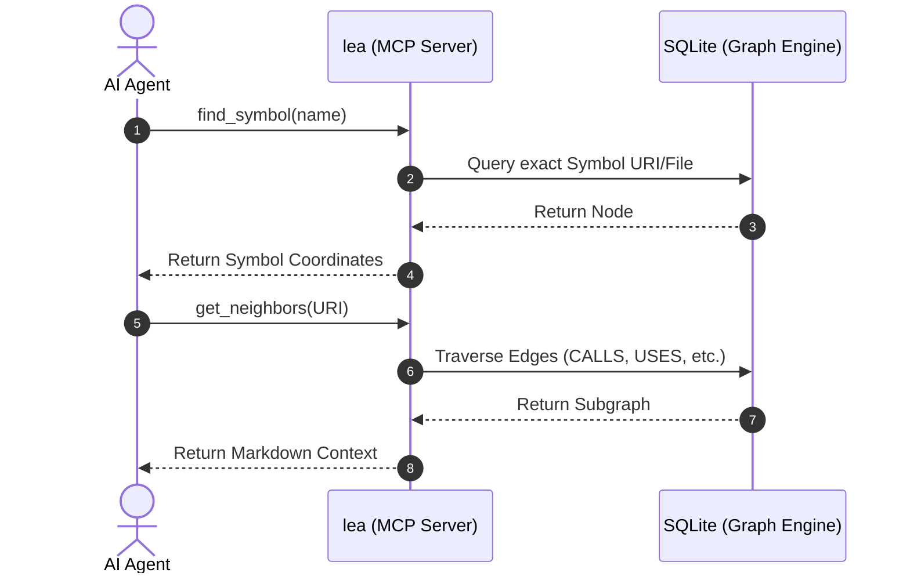

<div align="center">


# Lea

### Structural reasoning engine for AI-native software engineering.

**Lea transforms repositories into deterministic structural graphs — enabling AI agents and developers to reason about architecture, dependencies, execution flow, and system impact with minimal context and maximum precision.**

[](https://golang.org/doc/devel/release.html)
[](https://opensource.org/licenses/MIT)
[](https://github.com/PizenLabs/lea/actions)
[](https://goreportcard.com/report/github.com/PizenLabs/lea)
[](https://github.com/PizenLabs/lea/stargazers)

---

**Lynx discovers. Lea reasons.**

[Vision](#the-vision) •
[Features](#key-features) •
[Architecture](#architecture) •
[.lea Metadata System](#lea-metadata-system) •
[Installation](#installation) •
[Quick Start](#quick-start) •
[Command Guide](#command-guide) •
[Export Targets](#export-targets) •
[Architecture Guardrails](#architecture-guardrails) •
[Ecosystem](#ecosystem-separation) •
[Roadmap](#roadmap) •
[Contributing](#contributing)

</div>

---

## The Vision

Modern AI coding systems suffer from context window limitations, token inflation, and "context entropy." Most rely on probabilistic semantic chunking (embeddings), which often loses the architectural "big picture."

**Software is symbolic, not just semantic.** `lea` focuses on:

1.  **Structural Retrieval First** — Symbols, dependencies, call graphs, and architectural boundaries.
2.  **Semantic Retrieval Second** — Natural language understanding on top of structural certainty.

Lea is the structural counterpart to [Lynx](https://github.com/PizenLabs/lynx) (the discovery engine). Together they form the PizenLabs ecosystem: Lynx discovers, Lea reasons, agents execute.

---

## Key Features

- **Multi-Language AST Indexing**: Native support for **Go** (`go/ast`) and **Python**, **TypeScript**, and **Rust** via Tree-sitter.
- **Structural Graph Engine**: Models your codebase as a graph of functions, structs, interfaces, and their relationships (`CALLS`, `IMPLEMENTS`, `USES`, `BELONGS_TO`, `FLOWS_THROUGH`, `IMPLEMENTS_METHOD`, `IMPORTS`, `DEPENDS_ON`).
- **AI Context Compiler**: Generates high-signal, markdown-optimized context for LLMs (Claude, GPT, Gemini) using deterministic retrieval with **token-budget awareness**.
- **Model Context Protocol (MCP)**: Expose your codebase structure directly to AI agents via a standardized protocol — exposes tools for symbol context, neighbor lookup, call tracing, execution path analysis, and architecture validation.
- **Blast Radius Analysis**: Recursively trace incoming dependencies to determine the full impact of a code change, including direct/indirect callers, interfaces, and tests.
- **Symbol Discovery**: Official symbol registry for discovering available functions, structs, interfaces, and packages — filterable by kind (`--kind`) and package (`--pkg`).
- **Architectural Guardrails**: Define and enforce architectural boundaries using an explicit **Allow/Deny** rule engine with YAML-based layer configuration and pattern matching.
- **Interactive TUI**: A rich, terminal-based (Bubble Tea) explorer for fuzzy symbol navigation and dependency browsing.
- **Control Flow & Architecture Tracing**: Trace execution paths (`flow`) and recursive call graph hierarchies (`trace`) against architectural constraints.
- **Cross-Package Resolution**: Full support for repository-wide symbol resolution, including internal module calls and external package dependencies with local variable type inference and struct field chain resolution.
- **Incremental & Reactive**: Real-time graph updates using `fsnotify` without re-indexing the entire repository (`watch`).
- **.lea Metadata System**: Generates deterministic machine-readable metadata (`protocol.json`, `workspace.json`, `intent.json`, `memory.json`, `limitations.json`) for AI agent integration.
- **Agent Export System**: Generate bootstrap rule pointers for **11 AI agent ecosystems** — Claude, Cursor, OpenCode, Codex, Gemini, Pi, Antigravity, Copilot, Aider, OpenHands, and Continue.
- **Interface Implementation Resolution**: Deferred structural sub-typing resolution — matches concrete struct method sets against interface signatures and injects `IMPLEMENTS` and `IMPLEMENTS_METHOD` edges.

---

## Architecture

`lea` is built with a modular, performance-oriented architecture designed for local execution:

| Layer | Technology | Responsibility |
| :--- | :--- | :--- |
| **Parser Layer** | Native `go/ast` + Tree-sitter | Multi-language symbol extraction, call graph, control flow |
| **Graph Engine** | In-memory relationships | Symbol nodes, directed edge types (8 kinds), sequence ordering |
| **Storage Layer** | SQLite (via `modernc.org/sqlite`) | Persistent graph with recursive CTEs for complex traversals |
| **Integration Layer** | Bubble Tea (TUI) + MCP (stdio) | Human and AI agent interfaces |
| **Workspace Layer** | JSON metadata engine | Deterministic facts, protocols, limitations, memory |

###  Architecture Diagram

```text
       ┌────────────────────────────────────────────────────────┐
       │                 Local Filesystem Event                 │
       └───────────────────────────┬────────────────────────────┘
                                   │ (fsnotify)
                                   ▼
       ┌────────────────────────────────────────────────────────┐
       │ Incremental Parser Layer (Native Go AST / Tree-sitter) │
       └───────────────────────────┬────────────────────────────┘
                                   │ (Extracted Symbols)
                                   ▼
       ┌────────────────────────────────────────────────────────┐
       │   Storage Layer: SQLite Graph Engine (Recursive CTEs)  │
       └───────────────────────────┬────────────────────────────┘
                                   │
                    ┌──────────────┴──────────────┐
                    ▼                             ▼
       ┌────────────────────────┐    ┌──────────────────────────┐
       │   Integration Layer    │    │     Retrieval Engine     │
       │   (Bubble Tea TUI)     │    │   (MCP Server for AIs)   │
       └────────────────────────┘    └──────────────────────────┘
```

### Graph Node Types

| Type | Description |
| :--- | :--- |
| `function` | Standalone function |
| `method` | Method belonging to a type |
| `struct` | Structure or class definition |
| `interface` | Interface or protocol definition |
| `package` | Software package or namespace |
| `module` | Software module (file in non-Go languages) |
| `flow` | Data or control flow path |

### Graph Edge Types

| Type | Description |
| :--- | :--- |
| `CALLS` | One symbol calls another |
| `IMPLEMENTS` | A type implements an interface |
| `USES` | One symbol uses/references another |
| `IMPORTS` | One file/package imports another |
| `BELONGS_TO` | Containment (method→type, type→package) |
| `DEPENDS_ON` | General dependency |
| `FLOWS_THROUGH` | Data/control flow between symbols |
| `IMPLEMENTS_METHOD` | Concrete method→interface method binding |

---

## .lea Metadata System

After running `lea index`, the `.lea/` directory contains a complete deterministic metadata framework for AI agent integration:

| File | Purpose | Schema |
| :--- | :--- | :--- |
| `graph.db` | SQLite structural graph database | Binary |
| `protocol.json` | **Machine-to-Machine execution contract.** Defines initialization lifecycle, execution pipeline (discover → reason), tool command registry, strict runtime rules, and hard boundary abort conditions. | JSON v1.0 |
| `workspace.json` | **Immutable repository facts.** Contains repo root, module name, primary language, languages detected, frameworks, graph statistics (symbols, nodes, edges), lea version, and generation timestamp. | JSON v1.0 |
| `intent.json` | **Human-defined architectural boundaries.** Product goals, architecture goals, ownership, constraints, and forbidden changes. Editable by developers to guide agent behavior. | JSON v1.0 |
| `memory.json` | **Dynamic operational storage.** Tracks hotspots, frequently changed files, historical failures, and successful patterns. Evolves over time. | JSON v1.0 |
| `limitations.json` | **System blind spots.** Logs unsupported languages, missing graph dimensions (data flow, type hierarchy, inheritance graph), and confidence limitations to prevent agent hallucination. | JSON v1.0 |

### Agent Integration Workflow

The `protocol.json` enforces a strict lifecycle for AI agents:

1. **Read** `.lea/protocol.json` and `.lea/workspace.json` as first tool calls
2. **Discover** — Use `lx search`/`lx resolve` (or fallback bash equivalents) to find exact symbol coordinates
3. **Reason** — Use `lea impact`, `lea context`, `lea flow` for structural traversal
4. **Modify** — Only after completing discovery and reasoning phases

---

## Installation

### Go Install

```bash
go install github.com/PizenLabs/lea/cmd/lea@latest
```

### Install Script (curl)

```bash
curl -fsSL https://raw.githubusercontent.com/PizenLabs/lea/main/scripts/install.sh | bash
```

### Homebrew (Tap)

```bash
brew tap PizenLabs/tap
brew install lea
```

### From Source

```bash
# Clone the repository
git clone https://github.com/PizenLabs/lea.git
cd lea

# Build the binary
make build

# Install to your GOPATH/bin
make install
```

### Check Version

```bash
lea version
```

Current stable version: **0.2.0**

---

## Quick Start

### 1. Index your project

Initialize the structural graph for your repository and generate the .lea metadata framework:

```bash
lea index .
```

This creates `.lea/graph.db`, `workspace.json`, `protocol.json`, `intent.json`, `memory.json`, and `limitations.json`.

### 2. Explore symbols

List all symbols in the registry, filter by kind or package:

```bash
lea symbols
lea symbols auth -k interface    # Filter by kind
lea symbols -p internal          # Filter by package
```

### 3. Universal MCP Install (Recommended)

Register `lea` and `lynx` as MCP tools across all supported AI agents in one command:

```bash
lea mcp install
```

This auto-detects installed tools (Claude Code, VS Code Cline/Roo Code/Codex CLI, OpenCode, Pi, Zed, Gemini CLI, OpenClaw, Aider, Antigravity, Kiro, KiloCode) and injects the `pizen-lea` and `pizen-lynx` MCP entries into their config files — JSON, YAML, or TOML as appropriate.

Also generates `~/.config/pizen/instructions.md` with the dual-tool orchestration protocol.

### 4. Start the MCP Server

Connect your favorite AI agent directly to your codebase:

```bash
lea mcp
```

Exposes MCP tools: `get_symbol_context`, `find_neighbors`, `trace_calls`, `trace_execution_path`, `find_architecture_violations`.

### 5. Export agent configurations

Generate bootstrap rule pointers for AI agent ecosystems:

```bash
lea export claude     # Creates CLAUDE.md
lea export cursor     # Creates .cursor/rules/lea.mdc
lea export gemini     # Creates GEMINI.md
lea export aider      # Creates AIDER.md
lea export copilot    # Creates .github/copilot-instructions.md
lea export pi         # Creates .pi/AGENTS.md
```

### 6. Interactive Exploration

Launch the TUI for fuzzy symbol search and dependency browsing:

```bash
lea tui
```

### 7. Analyze impact and context

```bash
# Blast radius analysis
lea impact AuthService

# AI-optimized context with token budget
lea context "func:internal/cli/commands:Execute" --budget 2000

# Trace call graph
lea trace "func:internal/cli/commands:Execute"

# Ordered execution flow
lea flow "func:internal/cli/commands:Execute"

# Immediate dependencies
lea neighbors AuthService
```

### 8. Watch for changes

Real-time incremental indexing without full re-index:

```bash
lea watch .
```

---

## Command Guide

| Command | Description | Example |
| :--- | :--- | :--- |
| `index` | Build or update the structural graph and metadata | `lea index .` |
| `symbols` | Discover and list symbols in the registry | `lea symbols auth -k interface` |
| `tui` | Open the interactive symbol explorer (Bubble Tea) | `lea tui` |
| `mcp` | Start the Model Context Protocol server (stdio) | `lea mcp` |
| `mcp install` | One-command MCP setup for lea & lynx across 11 AI tools | `lea mcp install` |
| `export` | Generate AI agent configuration bootstrap pointers | `lea export claude` |
| `context` | Generate budget-aware context for a symbol | `lea context AuthService --budget 2000` |
| `trace` | Follow the recursive call graph from a function | `lea trace "func:internal/cli:Execute"` |
| `flow` | Inspect ordered control flow within a symbol | `lea flow "func:internal/cli:Execute"` |
| `neighbors` | Find immediate dependencies of a symbol | `lea neighbors AuthService` |
| `impact` | Recursive blast-radius analysis (direct/indirect callers, tests, interfaces) | `lea impact TokenService` |
| `violations` | Check for architectural boundary violations | `lea violations --config arch.yaml` |
| `watch` | Watch for file changes and update the graph incrementally | `lea watch .` |
| `version` | Print the lea version | `lea version` |

### Makefile Targets

| Target | Description |
| :--- | :--- |
| `build` | Build the binary to `bin/lea` |
| `test` | Run tests with -race and -cover |
| `lint` | Run golangci-lint |
| `install` | Build and install to GOPATH/bin |
| `index` | Build and run `lea index .` |
| `tui` | Build and launch the TUI |
| `mcp` | Build and start the MCP server |
| `watch` | Build and start the file watcher |
| `tidy` | Tidy go.mod and go.sum |
| `clean` | Remove build artifacts and `.lea/` data |

---

## Export Targets

Lea can generate bootstrap rule pointers for **11 AI agent ecosystems** via `lea export <target>`:

| Target | Output File | Ecosystem |
| :--- | :--- | :--- |
| `claude` | `CLAUDE.md` | Anthropic Claude Code |
| `cursor` | `.cursor/rules/lea.mdc` | Cursor IDE |
| `opencode` | `.opencode/AGENTS.md` | OpenCode Engine |
| `codex` | `.codex/AGENTS.md` | Codex Runtime |
| `gemini` | `GEMINI.md` | Google Gemini CLI |
| `pi` | `.pi/AGENTS.md` | Pi Coding Agent |
| `antigravity` | `.antigravity/AGENTS.md` | Antigravity Agent |
| `copilot` | `.github/copilot-instructions.md` | GitHub Copilot |
| `aider` | `AIDER.md` | Aider Chat |
| `openhands` | `.openhands/microagents/lea.yaml` | OpenHands Engine |
| `continue` | `.continue/rules/lea.md` | Continue Extension |

Each export is a **non-redundant deterministic pointer** that instructs the AI agent to read `.lea/protocol.json` and `.lea/workspace.json` as its first action, enforcing the discover-before-reason lifecycle.

---

## Architecture Guardrails

Lea supports defining architectural boundaries through YAML configuration. Create an `arch.yaml` file:

```yaml
layers:
  - name: handler
    patterns: ["internal/handler/**"]
    allow: ["service", "domain"]
    deny: ["repository", "infrastructure"]

  - name: service
    patterns: ["internal/service/**"]
    allow: ["domain", "repository"]
    deny: ["handler", "infrastructure"]

  - name: repository
    patterns: ["internal/repository/**"]
    allow: ["domain"]
    deny: ["handler", "service"]

  - name: domain
    patterns: ["internal/domain/**"]
    allow: ["*"]
    deny: []

  - name: infrastructure
    patterns: ["internal/infrastructure/**"]
    allow: ["domain"]
    deny: []

settings:
  allow_unknown: true
  allow_self: true
  default_allow_all: true
```

Then validate:

```bash
lea violations --config arch.yaml
```

The architecture engine:
- Maps files to layers via glob patterns
- Evaluates `CALLS`, `USES`, `DEPENDS_ON`, and `IMPORTS` edges
- Supports glob patterns with `**` for recursive matches
- Configurable behavior for unknown layers, self-references, and default allow/deny

---

## Ecosystem Separation

Lea is part of the PizenLabs ecosystem alongside [Lynx](https://github.com/PizenLabs/lynx). The two tools have strictly separated responsibilities:

| Aspect | Lynx | Lea |
| :--- | :--- | :--- |
| **Mission** | Convert intent into locations | Convert structure into reasoning |
| **Primary Question** | "Where should I look?" | "What happens if I change this?" |
| **Input** | Natural language | Exact symbol coordinates |
| **Output** | File paths, symbol references | Call hierarchy, execution paths, impact reports |
| **Techniques** | Semantic search, BM25, embeddings | Graph traversal, dependency analysis, architecture validation |
| **Must Not** | Build dependency graphs | Do semantic search/embeddings |

**Rule**: Lynx discovers. Lea reasons. Never reverse this relationship.

### Unified Workflow

```text
Human Intent
     │
     ▼
   Lynx          ← Natural language search ("How is auth implemented?")
     │
     ▼
 Exact Symbol    ← "func:internal/auth:Login"
     │
     ▼
    Lea          ← Structural reasoning (impact, context, flow)
     │
     ▼
 AI Agent        ← Code modifications with architectural awareness
```

---

## MCP Query Flow



## Incremental Indexing Loop

```text
[Filesystem Event: Modify/Create/Delete]
                   │
                   ▼
       ┌───────────────────────┐
       │   Debounce & Batch    │ (Gathers changes over ~500ms)
       └───────────┬───────────┘
                   │
                   ▼
       ┌───────────────────────┐
       │   Invalidation Stage  │ (Deletes affected Nodes & Edges in SQLite)
       └───────────┬───────────┘
                   │
                   ▼
       ┌───────────────────────┐
       │  Incremental Parsing  │ (Native go/ast or Tree-sitter AST extraction)
       └───────────┬───────────┘
                   │
                   ▼
       ┌───────────────────────┐
       │     Graph Commit      │ (Atomic SQL Transaction: Inserts new entities)
       └───────────────────────┘
```

---

## Troubleshooting

- **Empty graph?** Re-run `lea index .` and confirm your repository path is correct.
- **Missing symbols?** Confirm the target language parser is supported (Go, Python, Rust, TypeScript). Non-Go languages use Tree-sitter — file a GitHub issue for unsupported languages.
- **Architecture checks fail?** Ensure your rules file (e.g., `arch.yaml`) is present and valid YAML. Check layer patterns match your directory structure.
- **MCP not connecting?** Verify the MCP server is running (`lea mcp`) and your AI agent is configured to connect to it via stdio.
- **MCP install skips a tool?** That's expected — `lea mcp install` only injects entries into tools whose config directory already exists on your system, avoiding noise from uninstalled applications.
- **Missing agent on the install list?** Run `lea mcp install` — it currently supports 11 targets (Claude Code, VS Code Cline/Roo/Codex CLI, OpenCode, Pi, Zed, Gemini CLI, OpenClaw, Aider, Antigravity, Kiro, KiloCode).
- **TUI shows no symbols?** Ensure `lea index .` completed successfully — the TUI reads from `.lea/graph.db`.
- **Export file missing?** Check that you ran `lea export <target>` from the repository root. The tool creates the necessary subdirectories automatically.

---

## Roadmap

- [x] **Phase 1: MVP** — Go parser, SQLite storage, basic graph queries
- [x] **Phase 2: AI Context Layer** — High-signal markdown generation, context compilation
- [x] **Phase 3: Incremental Updates** — Real-time file watching and partial re-indexing
- [x] **Phase 4: MCP Integration** — Standardized protocol for AI agent connectivity
- [x] **Phase 5: Interactive TUI** — Fuzzy navigation and visual dependency exploration
- [x] **Phase 6: Multi-Language Support** — Tree-sitter integration for Python, Rust, and TypeScript
- [x] **Phase 7: Advanced Retrieval** — Control flow, architecture guardrails, blast radius
- [x] **Phase 8: .lea Metadata System** — protocol.json, workspace.json, intent.json, memory.json, limitations.json
- [x] **Phase 9: Agent Export System** — 11 AI ecosystem bootstrap pointers
- [x] **Phase 10: Interface Resolution** — IMPLEMENTS and IMPLEMENTS_METHOD edge injection
- [x] **Phase 11: Deep Selector Resolution** — Local variable type inference, struct field chain traversal, constructor return type registration

---

## Usage Patterns

### AI-Agent Workflow (MCP)

1. **Find the target symbol** to get exact file and symbol coordinates.
2. **Expand context** to pull immediate neighbors (`CALLS`, `USES`, `IMPLEMENTS`).
3. **Trace execution** to map the ordered call graph for the change.
4. **Check boundaries** against architecture rules before committing updates.

### Developer Workflow (CLI/TUI)

- Use `lea tui` for fuzzy symbol search and graph browsing.
- Use `lea context` to generate prompt-ready context for web LLMs.
- Use `lea flow` and `lea trace` to understand execution order and impact.
- Use `lea impact` for pre-refactor safety analysis.

### CI/CD Integration

- Run `lea violations --config arch.yaml` in CI to prevent architectural drift.
- Run `lea index .` after checkout to generate graph for downstream tools.

---

## Project Structure

```
lea/
├── bin/lea                        # Compiled binary
├── cmd/lea/main.go                 # CLI entrypoint
├── internal/
│   ├── ai/context/compiler.go      # AI context compilation engine
│   ├── architecture/               # Architecture rule engine
│   │   ├── config.go              # YAML configuration types
│   │   ├── load.go                # Config loader
│   │   ├── matcher.go             # Layer-to-file pattern matching
│   │   └── violations.go          # Violation detection engine
│   ├── cli/commands/              # All CLI subcommands (cobra)
│   │   ├── context.go             # lea context
│   │   ├── export.go              # lea export (11 targets)
│   │   ├── flow.go                # lea flow
│   │   ├── impact.go              # lea impact (blast radius)
│   │   ├── index.go               # lea index (+metadata generation)
│   │   ├── mcp.go                 # lea mcp (server + install)
│   │   ├── neighbors.go           # lea neighbors
│   │   ├── root.go                # Root command + symbol resolution
│   │   ├── symbols.go             # lea symbols
│   │   ├── trace.go               # lea trace
│   │   ├── tui.go                 # lea tui
│   │   ├── violations.go          # lea violations
│   │   ├── version.go             # lea version
│   │   └── watch.go               # lea watch
│   ├── graph/contracts/           # Graph node/edge type definitions
│   │   ├── edge.go               # 8 edge types
│   │   └── node.go               # 7 node types
│   ├── mcp/
│   │   ├── install/install.go     # MCP install (11 target writers)
│   │   └── server.go              # MCP server (5 tools)
│   ├── parser/
│   │   ├── contracts/parser.go    # Parser interface
│   │   ├── golang/parser.go       # Go AST parser with deep resolution
│   │   ├── resolver.go            # Cross-package resolution
│   │   ├── calls.go               # Call extraction
│   │   └── treesitter/            # Python/Rust/TypeScript parsers
│   ├── storage/
│   │   ├── contracts/store.go     # Store interface
│   │   └── sqlite/sqlite.go       # SQLite implementation
│   ├── tui/app.go                 # Bubble Tea TUI
│   ├── watcher/watcher.go         # fsnotify file watcher
│   └── workspace/ignore/matcher.go # .gitignore-aware file matcher
├── configs/                       # Configuration templates
├── docs/                          # Additional documentation
│   ├── architecture/              # Ecosystem boundary docs
│   │   ├── ECOSYSTEM_BOUNDARIES.md
│   │   └── ORIENTATION.md
│   └── report-issues/             # Issue analysis archives
├── scripts/install.sh             # Shell install script
├── testdata/                      # Test fixtures
├── Makefile                       # Build automation
└── GUIDE.md                       # Extended usage guide
```

---

## Contributing

Contributions are welcome! Please see [CONTRIBUTING.md](CONTRIBUTING.md) for guidelines on development, testing, and pull requests.

---

## License

`lea` is licensed under the [MIT License](LICENSE).

---

Built for the future of AI-native engineering. 🦾
